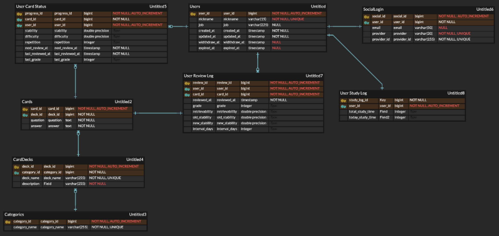
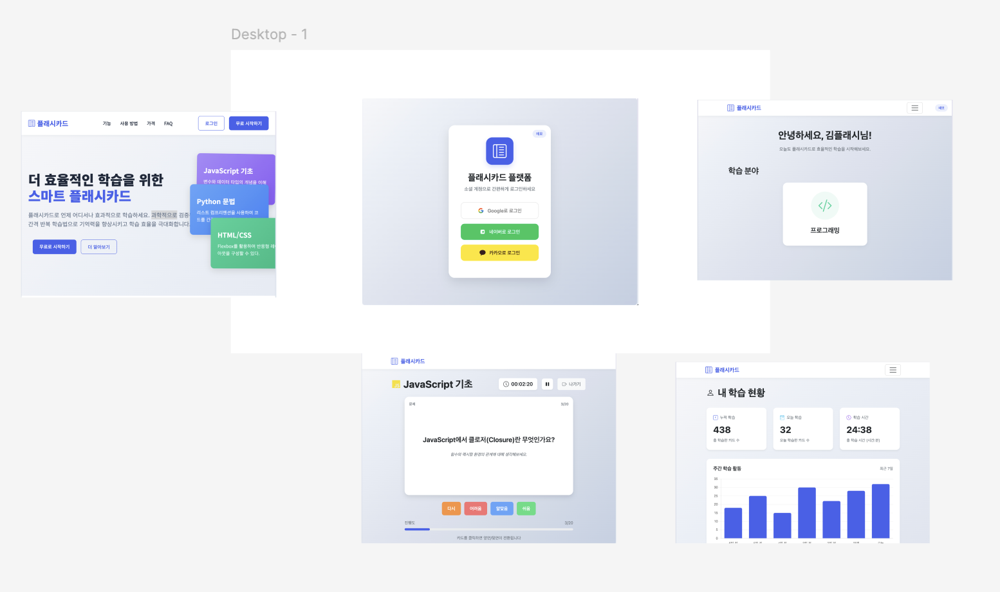

# 📅 회의록 - 2025-06-14

## 🧑‍💻 회의 정보

- **날짜:** 2025-06-14
- **시간:** 14:00 - 18:00
- **회의 장소:** 커피빈 신용산역레미안점
- **회의 유형:** 프로젝트 초기 설정
- **참석자:** @minho00123, @99MotiveU, @hwa3845
- **불참자:**
- **작성자:** @minho00123

## 🔙 지난 회의 결과 (간략 요약) & 이전 회의 액션 아이템 확인

- 문서화 작업 (소셜 로그인, SRS 알고리즘 공부 후 다시 진행)

## 📌 안건 목록

1. [x] ERD, 와이어프레임

## ✅ 회의 내용 요약

| 안건              | 논의 내용 | 결정 사항 | 담당자 |
| ----------------- | --------- | --------- | ------ |
| ERD, 와이어프레임 | 문서 작성 | 초안 완성 |        |

### 논의 내용

**1. ERD, 와이어프레임**

- User, Card ERD 1차 구조 완성([ERDCloud](https://www.erdcloud.com/d/jQppx8LteKg3McE2P))
  

- 와이어프레임 초안 완성([Figma](https://www.figma.com/design/TsOhGto0SoP0jaHeRHn0y6/Qversity?node-id=0-1&t=j1dEpZL9RGktKKWG-1))
  

**결정 사항:** ERD 및 와이어프레임 초안 완성

## 📅 다음 일정

- **날짜:** 2025-06-16
- **시간:** 19:00
- **장소:** 오프라인
- **주요 의제:**
  - API 명세서
  - Boiler Plate(개발 환경 설정)
  - GitHub 규칙
  - GitHub Issue 작성
  - Git Workflow
